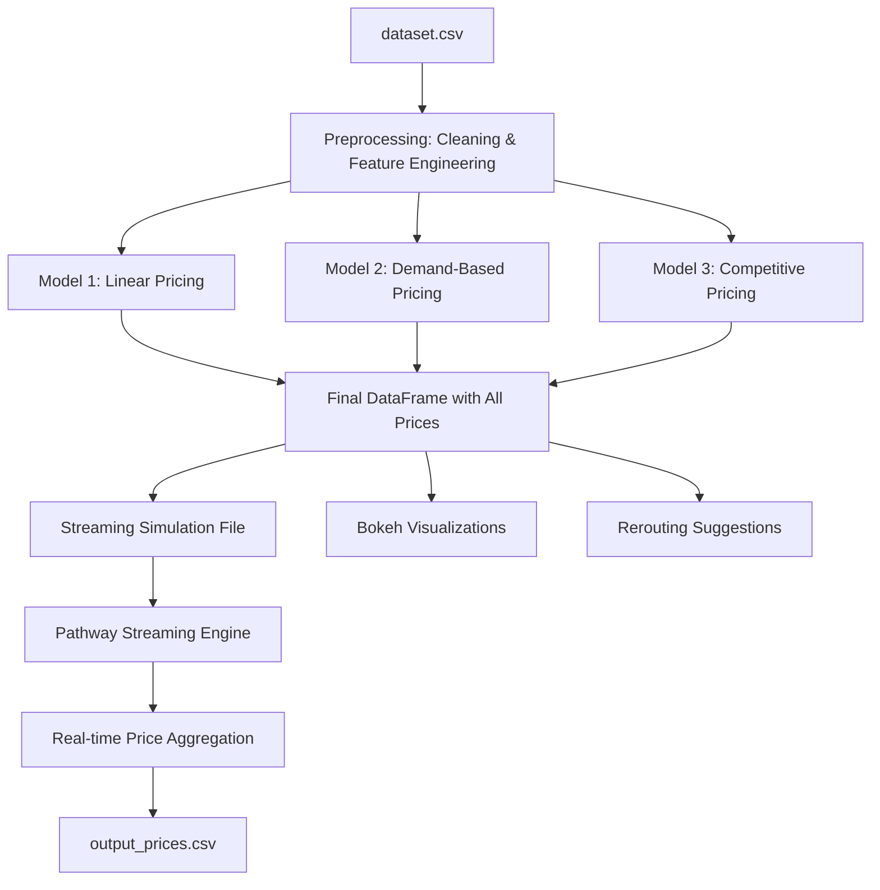

# Dynamic Pricing for Urban Parking Lots

**Capstone Project - Summer Analytics 2025**
*Hosted by Consulting & Analytics Club × Pathway*

---

## 🚗 Project Overview

This project tackles urban parking inefficiencies by implementing a dynamic pricing system for 14 parking lots based on real-time and historical data. It integrates data science principles and real-time data pipelines using **Python**, **Pandas**, **NumPy**, **Bokeh**, and **Pathway** to simulate and predict parking prices in a realistic streaming environment.

---

## 📊 Tech Stack

* **Python** (Data processing, model logic)
* **Pandas / NumPy** (Data handling and computation)
* **Bokeh** (Real-time interactive visualizations)
* **Pathway** (Real-time streaming data pipeline)

---

## 🔄 Architecture Diagram (Mermaid)




---

## 📚 Project Details

### ✅ Objective

* Build a dynamic pricing engine using 3 models:

  1. **Linear Model**: Price increases linearly with occupancy rate.
  2. **Demand-Based Model**: Includes occupancy, traffic, special day, queue length, vehicle type.
  3. **Competitive Model**: Factors in proximity-based competitor pricing.

* Suggest rerouting in congested situations.

* Visualize pricing behavior in real-time.

### 📅 Dataset

* 73 days of timestamped data across 14 parking locations
* Features:

  * Occupancy, Capacity, Queue Length
  * Vehicle Type, Special Day, Traffic Level
  * Latitude/Longitude (for competitive model)

---

## 🌐 How It Works

1. **Data Preprocessing**: Cleans and engineers features from raw CSV.
2. **Pricing Models**:

   * `model_1_linear()` implements baseline occupancy-based pricing
   * `model_2_demand()` computes demand using multiple weighted features
   * `model_3_competition()` adjusts prices based on surrounding lot competition using haversine distance
3. **Real-Time Simulation**:

   * `simulate_streaming()` writes rows to a CSV with time delay
   * `Pathway` reads and processes streamed data in real-time
4. **Visualization**:

   * `Bokeh` renders line plots of pricing over time
   * Competitor bar plots at given timestamps
5. **Rerouting Functionality** (Optional): Suggests alternate lots when overloaded

---

## 🎨 Visualizations

* Real-time line charts for price trends across models
* Competitor bar charts comparing prices of nearby lots
* Console-based real-time rerouting suggestions

---

## 🔗 Repository Contents

```
/
├── Dynamic Pricing for Urban Parking Lots.ipynb   # Main implementation notebook
├── dataset.csv                                    # Original data
├── modified_dataset(2).csv                           # Cleaned data with pricing columns
├── streaming_dataset(1).csv                          # Simulated real-time data stream
├── output_prices(!).csv                              # Output from Pathway pipeline
├── README.md                                      # Project documentation
├── report.pdf                                     # (Optional) Written project report
├── mermaid_diagram.png / diagram.mmd              # (Optional) Mermaid diagram for GitHub
```

---

## 🔹 Instructions to Run

1. Open the notebook in Google Colab
2. Ensure required libraries are installed:

   ```python
   !pip install pandas numpy bokeh pathway
   ```
3. Run all cells in order
4. Visual outputs and real-time predictions will be shown inline

---

## 🎓 Authors

**Prashun Mishra**
*Summer Analytics 2025 | Consulting & Analytics Club x Pathway*

---

## 🎓 Resources Used

* [Pathway Docs](https://pathway.com/developers/)
* [Mermaid Live Editor](https://mermaid.live/edit)
* [Bokeh Visualization Guide](https://docs.bokeh.org)

---

Feel free to ⭐ the official [Pathway GitHub repo](https://github.com/pathwaycom/pathway)!
